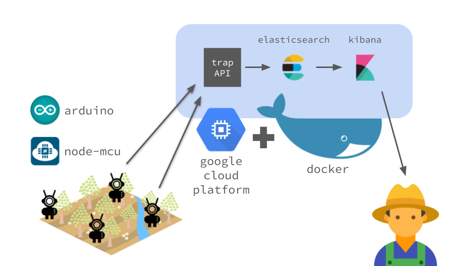

# Include Trap


### Requirements
* [Docker](https://docs.docker.com/install/)
* [Docker Compose](https://docs.docker.com/compose/install/)

### Run
```shell
docker-compose up -d
```

### Features
* Fazer amostragem populacional de pragas em armadilhas
* Medir a umidade do ambiente
* Medir a temperatura do ambiente
* Identificar a ocorrência de chuva
* Apresentar visualizações e dashboards
